# V3-Ts-Cms 开发文档

## 一、项目介绍

## 二、创建项目

```shell
vue create v3-ts-cms
```

## 三、使用 Git 对项目进行版本控制

### 3.1 将本地仓库和远程仓库建立连接

```shell
git remote add origin git@github.com:YangMr/vue-shop-admin.git
```

### 3.2 将本地仓库的代码推送到远程仓库

```shell
git push origin main
```

## 四、代码规范

### 4.1 集成 editorconfig 配置

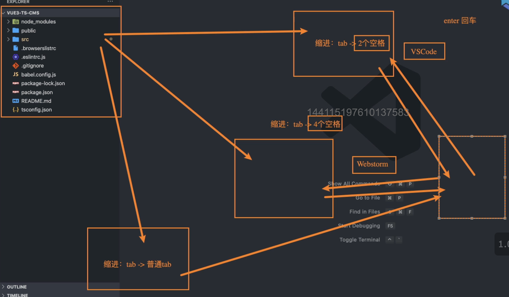

EditorConfig 有助于为不同 IDE 编辑器上处理同一项目的多个开发人员维护一致的编码风格。

```shell
# http://editorconfig.org

root = true

[*] # 表示所有文件适用
charset = utf-8 # 设置文件字符集为 utf-8
indent_style = space # 缩进风格（tab | space）
indent_size = 2 # 缩进大小
end_of_line = lf # 控制换行类型(lf | cr | crlf)
trim_trailing_whitespace = true # 去除行首的任意空白字符
insert_final_newline = true # 始终在文件末尾插入一个新行

[*.md] # 表示仅 md 文件适用以下规则
max_line_length = off
trim_trailing_whitespace = false
```

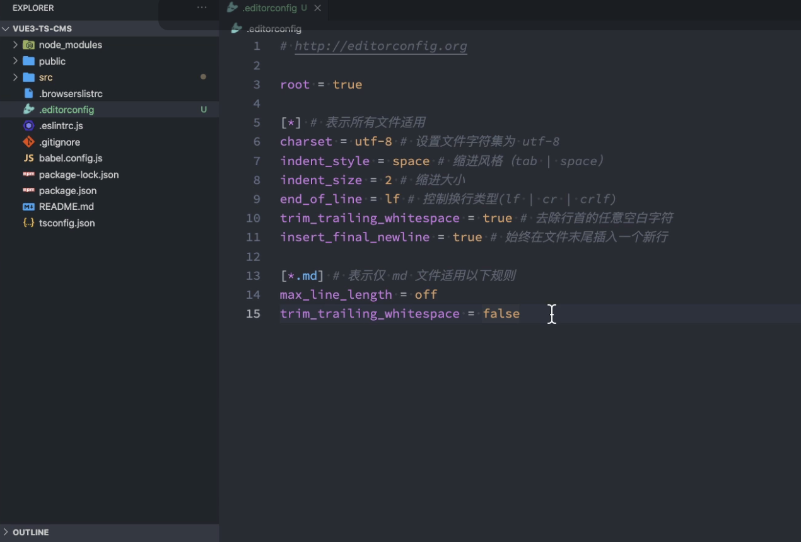

VSCode 需要安装一个插件：EditorConfig for VS Code

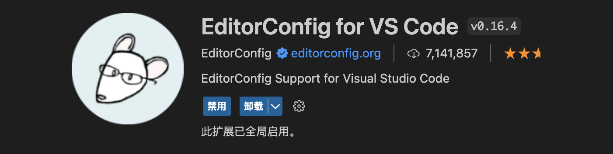

### 4.2 使用 prettier 工具

Prettier 是一款强大的代码格式化工具，支持 JavaScript、TypeScript、CSS、SCSS、Less、JSX、Angular、Vue、GraphQL、JSON、Markdown 等语言，基本上前端能用到的文件格式它都可以搞定，是当下最流行的代码格式化工具。

#### 4.2.1 VSCode 需要安装 prettier 的插件

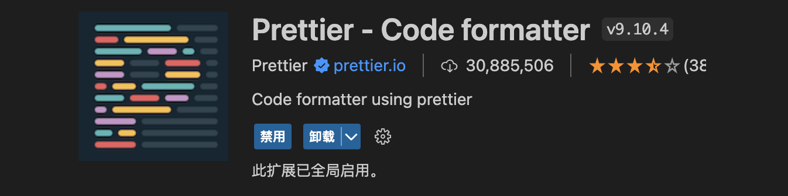

#### 4.2.2 安装 prettier

```shell
npm install prettier -D
```

#### 4.2.3 配置.prettierrc 文件：

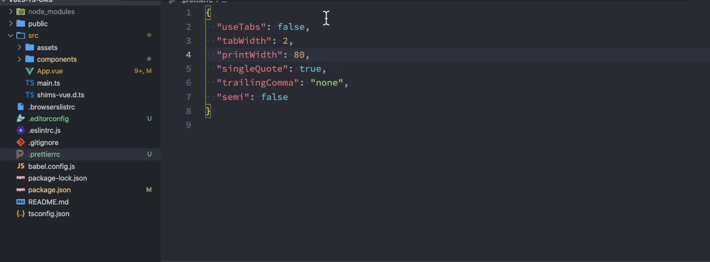

- useTabs：使用 tab 缩进还是空格缩进，选择 false；
- tabWidth：tab 是空格的情况下，是几个空格，选择 2 个；
- printWidth：当行字符的长度，推荐 80，也有人喜欢 100 或者 120；
- singleQuote：使用单引号还是双引号，选择 true，使用单引号；
- trailingComma：在多行输入的尾逗号是否添加，设置为 `none`；
- semi：语句末尾是否要加分号，默认值 true，选择 false 表示不加；

```json
{
  "useTabs": false,
  "tabWidth": 2,
  "printWidth": 80,
  "singleQuote": true,
  "trailingComma": "none",
  "semi": false
}
```

#### 4.2.4 创建.prettierignore 忽略文件

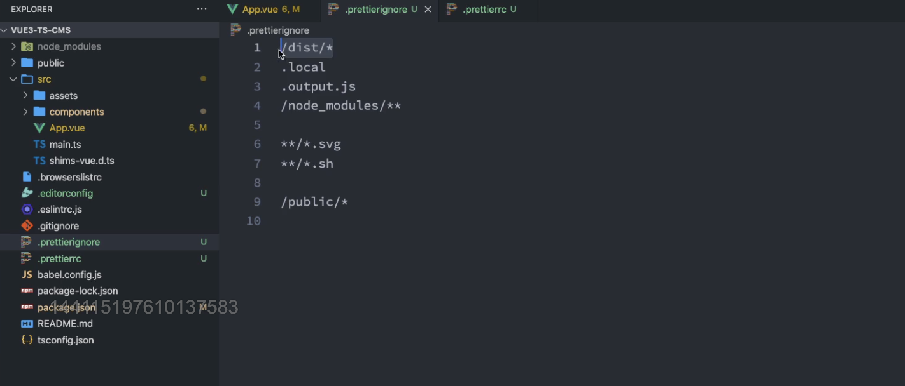

```shell
/dist/*
.local
.output.js
/node_modules/**

**/*.svg
**/*.sh

/public/*
```

#### 4.2.5 测试 prettier 是否生效

- 测试一：在代码中保存代码；
- 测试二：配置一次性修改的命令；

在 package.json 中配置一个 scripts：

```json
"prettier": "prettier --write ."
```

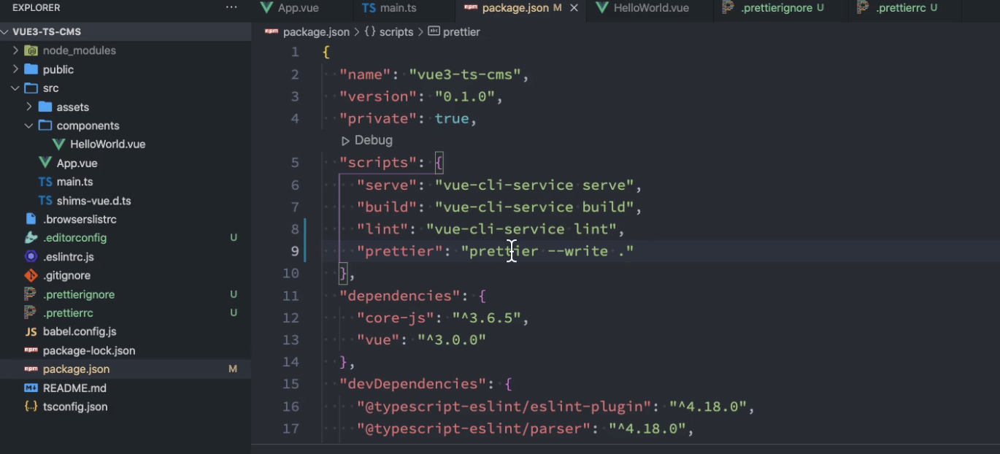

### 4.3 使用 ESLint 检测

#### 4.3.1 什么是 eslint?

ESLint 是一个开源的 JavaScript 代码检查工具，它可以帮助开发者在编写代码时发现和修复代码错误、维护一致的代码风格、避免潜在的问题等。ESLint 支持在命令行中运行，也可以集成到各种开发工具中，如编辑器、集成开发环境等。通过配置 ESLint，开发者可以自定义检查规则和限制，以满足项目的需求和约定.

#### 4.3.2 如何使用 eslint?

1. 在前面创建项目的时候，我们就选择了 ESLint，所以 Vue 会默认帮助我们配置需要的 ESLint 环境。

2. VSCode 需要安装 ESLint 插件：

   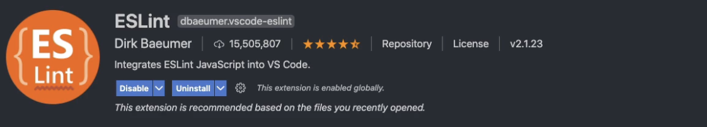

3. 解决 eslint 和 prettier 冲突的问题

   安装插件：（vue 在创建项目时，如果选择 prettier，那么这两个插件会自动安装）

   ```shell
   npm i eslint-plugin-prettier eslint-config-prettier -D
   ```

   添加 prettier 插件：

   ```shell
     extends: [
       "plugin:vue/vue3-essential",
       "eslint:recommended",
       "@vue/typescript/recommended",
       'plugin:prettier/recommended'
     ],
   ```

### 4.4 git Husky 和 eslint

虽然我们已经要求项目使用 eslint 了，但是不能保证组员提交代码之前都将 eslint 中的问题解决掉了：

- 也就是我们希望保证代码仓库中的代码都是符合 eslint 规范的；

- 那么我们需要在组员执行 `git commit ` 命令的时候对其进行校验，如果不符合 eslint 规范，那么自动通过规范进行修复

那么如何做到这一点呢？可以通过 Husky 工具：

- husky 是一个 git hook 工具，可以帮助我们触发 git 提交的各个阶段：pre-commit、commit-msg、pre-push

如何使用 husky 呢？

这里我们可以使用自动配置命令：

```shell
npx husky-init && npm install
```

这里会做三件事：

1. 安装 husky 相关的依赖：
   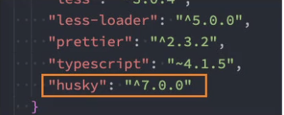
2. 在项目目录下创建 `.husky` 文件夹：

```shell
npx huksy install
```

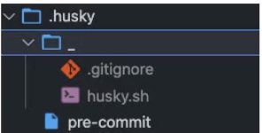

3. 在 package.json 中添加一个脚本：

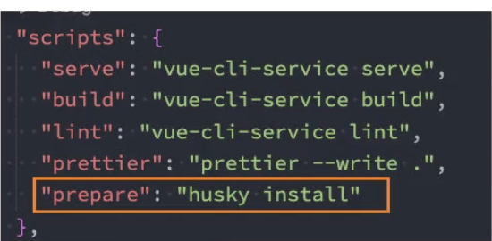

4. 接下来，我们需要去完成一个操作：在进行 commit 时，执行 lint 脚本：

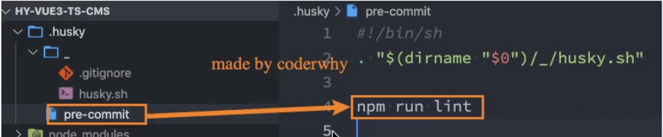

5. 这个时候我们执行 git commit 的时候会自动对代码进行 lint 校验。

### 4.5 git commit 规范

#### 4.5.1 代码提交风格

通常我们的 git commit 会按照统一的风格来提交，这样可以快速定位每次提交的内容，方便之后对版本进行控制。

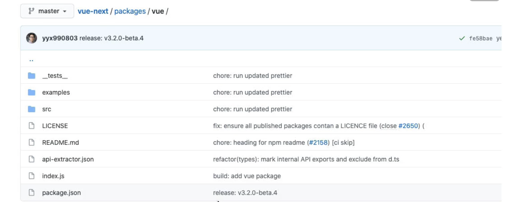

但是如果每次手动来编写这些是比较麻烦的事情，我们可以使用一个工具：Commitizen

- Commitizen 是一个帮助我们编写规范 commit message 的工具；

1. 安装 Commitizen

```shell
npm install commitizen -D
```

2. 安装 cz-conventional-changelog，并且初始化 cz-conventional-changelog：

```
npx commitizen init cz-conventional-changelog --save-dev --save-exact
```

这个命令会帮助我们安装 cz-conventional-changelog：


并且在 package.json 中进行配置：

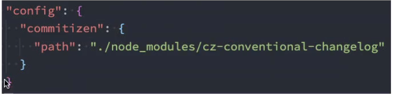

这个时候我们提交代码需要使用 `npx cz`：

- 第一步是选择 type，本次更新的类型

| Type     | 作用                                                                                   |
| -------- | -------------------------------------------------------------------------------------- |
| feat     | 新增特性 (feature)                                                                     |
| fix      | 修复 Bug(bug fix)                                                                      |
| docs     | 修改文档 (documentation)                                                               |
| style    | 代码格式修改(white-space, formatting, missing semi colons, etc)                        |
| refactor | 代码重构(refactor)                                                                     |
| perf     | 改善性能(A code change that improves performance)                                      |
| test     | 测试(when adding missing tests)                                                        |
| build    | 变更项目构建或外部依赖（例如 scopes: webpack、gulp、npm 等）                           |
| ci       | 更改持续集成软件的配置文件和 package 中的 scripts 命令，例如 scopes: Travis, Circle 等 |
| chore    | 变更构建流程或辅助工具(比如更改测试环境)                                               |
| revert   | 代码回退                                                                               |

- 第二步选择本次修改的范围（作用域）


- 第三步选择提交的信息

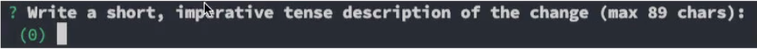

- 第四步提交详细的描述信息


- 第五步是否是一次重大的更改


- 第六步是否影响某个 open issue


我们也可以在 scripts 中构建一个命令来执行 cz：

#### 4.5.2 代码提交验证

如果我们按照 cz 来规范了提交风格，但是依然有同事通过 `git commit` 按照不规范的格式提交应该怎么办呢？

- 我们可以通过 commitlint 来限制提交；

1. 安装 @commitlint/config-conventional 和 @commitlint/cli

```shell
npm i @commitlint/config-conventional @commitlint/cli -D
```

2. 在根目录创建 commitlint.config.js 文件，配置 commitlint

```js
module.exports = {
  extends: ['@commitlint/config-conventional']
}
```

3. 使用 husky 生成 commit-msg 文件，验证提交信息：

```shell
npx husky add .husky/commit-msg "npx --no-install commitlint --edit $1"
```

## 五、第三方库集成

### 5.1 vue.config.js 配置

vue.config.js 有三种配置方式：

- 方式一：直接通过 CLI 提供给我们的选项来配置：
  - 比如 publicPath：配置应用程序部署的子目录（默认是 `/`，相当于部署在 `https://www.my-app.com/`）；
  - 比如 outputDir：修改输出的文件夹；
- 方式二：通过 configureWebpack 修改 webpack 的配置：
  - 可以是一个对象，直接会被合并；
  - 可以是一个函数，会接收一个 config，可以通过 config 来修改配置；
- 方式三：通过 chainWebpack 修改 webpack 的配置：
  - 是一个函数，会接收一个基于 [webpack-chain](https://github.com/mozilla-neutrino/webpack-chain) 的 config 对象，可以对配置进行修改；

```javascript
const path = require('path')

module.exports = {
  // 方式一: 默认配置
  outputDir: './build',
  // 配置方式二: 将现有的配置合并到webpack中
  // configureWebpack: {
  //   resolve: {
  //     alias: {
  //       views: '@/views'
  //     }
  //   }
  // }
  // configureWebpack: (config) => {
  //   config.resolve.alias = {
  //     '@': path.resolve(__dirname, 'src'),
  //     views: '@/views'
  //   }
  // },
  // 配置方式三: 支持链式调用三
  chainWebpack: (config) => {
    config.resolve.alias
      .set('@', path.resolve(__dirname, 'src'))
      .set('views', '@/views')
  }
}
```

### 5.2 vue-router 集成

安装 vue-router 的最新版本：

```shell
npm install vue-router@next
```

创建 router 对象：

```javascript
import { createRouter, createWebHashHistory } from 'vue-router'
import { RouteRecordRaw } from 'vue-router'

const routes: RouteRecordRaw[] = [
  {
    path: '/',
    redirect: '/main'
  },
  {
    path: '/main',
    component: () => import('../views/main/main.vue')
  },
  {
    path: '/login',
    component: () => import('../views/login/login.vue')
  }
]

const router = createRouter({
  routes,
  history: createWebHashHistory()
})

export default router
```

引入 router：

```javascript
import router from './router'

createApp(App).use(router).mount('#app')
```

在 App.vue 中配置跳转：

```html
<template>
  <div id="app">
    <router-link to="/login">登录</router-link>
    <router-link to="/main">首页</router-link>
    <router-view></router-view>
  </div>
</template>
```

### 5.3 vuex 集成

安装 vuex：

```shell
npm install vuex@next
```

创建 store 对象：

```ts
import { createStore } from 'vuex'

const store = createStore({
  state() {
    return {
      name: 'coderwhy'
    }
  }
})

export default store
```

安装 store：

```ts
createApp(App).use(router).use(store).mount('#app')
```

在 App.vue 中使用：

```html
<h2>{{ $store.state.name }}</h2>
```

### 5.4 element-plus 集成

Element Plus，一套为开发者、设计师和产品经理准备的基于 Vue 3.0 的桌面端组件库：

- 相信很多同学在 Vue2 中都使用过 element-ui，而 element-plus 正是 element-ui 针对于 vue3 开发的一个 UI 组件库；
- 它的使用方式和很多其他的组件库是一样的，所以学会 element-plus，其他类似于 ant-design-vue、NaiveUI、VantUI 都是差不多的；

安装 element-plus

```shell
npm install element-plus
```

#### 5.4.1 全局引入

一种引入 element-plus 的方式是全局引入，代表的含义是所有的组件和插件都会被自动注册：

```js
import ElementPlus from 'element-plus'
import 'element-plus/lib/theme-chalk/index.css'

import router from './router'
import store from './store'

createApp(App).use(router).use(store).use(ElementPlus).mount('#app')
```

#### 5.4.2 按需引入

也就是在开发中用到某个组件对某个组件进行引入：

```vue
<template>
  <div id="app">
    <router-link to="/login">登录</router-link>
    <router-link to="/main">首页</router-link>
    <router-view></router-view>

    <h2>{{ $store.state.name }}</h2>

    <el-button>默认按钮</el-button>
    <el-button type="primary">主要按钮</el-button>
    <el-button type="success">成功按钮</el-button>
    <el-button type="info">信息按钮</el-button>
    <el-button type="warning">警告按钮</el-button>
    <el-button type="danger">危险按钮</el-button>
  </div>
</template>

<script lang="ts">
import { defineComponent } from 'vue'

import { ElButton } from 'element-plus'

export default defineComponent({
  name: 'App',
  components: {
    ElButton
  }
})
</script>

<style lang="less"></style>
```

但是我们会发现是没有对应的样式的，引入样式有两种方式：

- 全局引用样式（像之前做的那样）；

- 局部引用样式；

  1.首先你需要安装`unplugin-vue-components` 和 `unplugin-element-plus`这两款插件

```shell
npm install -D unplugin-vue-components unplugin-element-plus
```

2.配置 vue.config.js

```js
const { defineConfig } = require('@vue/cli-service')
module.exports = defineConfig({
  transpileDependencies: true,
  configureWebpack: {
    plugins: [
      require('unplugin-element-plus/webpack')({
        // options
      }),
      require('unplugin-vue-components/webpack')({
        /* options */
      })
    ]
  }
})

```

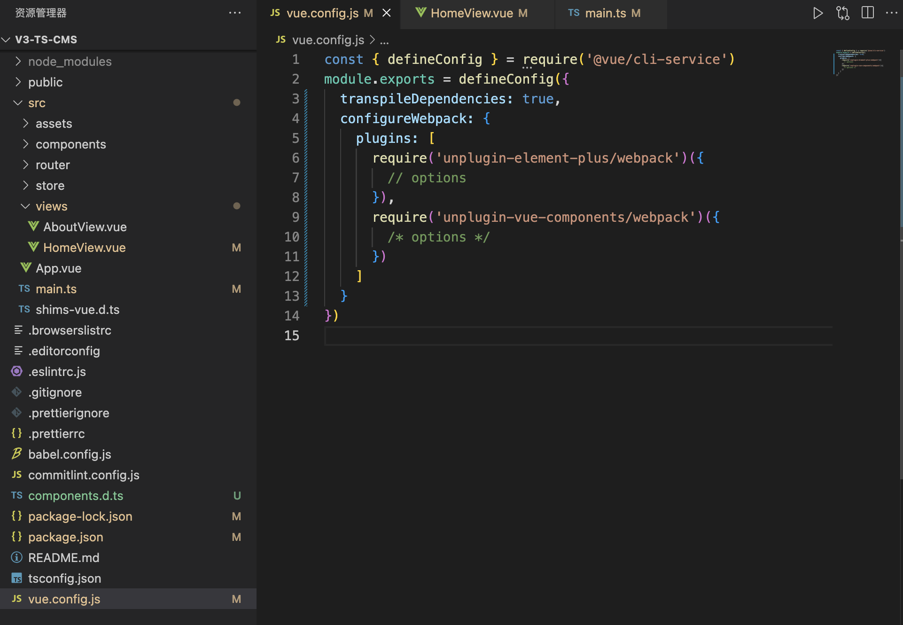

3. 按需注册组件

`main.ts`

```javascript
import { createApp } from 'vue'
import App from './App.vue'
import router from './router'
import store from './store'
import { ElButton, ElForm, ElFormItem, ElInput, ElRadio } from 'element-plus'
const components = [ElButton, ElForm, ElFormItem, ElInput, ElRadio]

const app = createApp(App)

for (const component of components) {
  app.component(component.name, component)
}

app.use(store)
app.use(router)
app.mount('#app')

```

4. 抽离业务

`src/global/index.ts`

```javascript
import { App } from 'vue'
import { ElButton, ElForm, ElFormItem, ElInput, ElRadio } from 'element-plus'
const components = [ElButton, ElForm, ElFormItem, ElInput, ElRadio]

export function registerApp(app: App) {
  for (const component of components) {
    app.component(component.name, component)
  }
}

```

`src/main.ts`

```javascript
import { createApp } from 'vue'
import App from './App.vue'
import router from './router'
import store from './store'
import { registerApp } from './global'

const app = createApp(App)

registerApp(app)
app.use(store)
app.use(router)
app.mount('#app')

```

5. 业务再进一步抽离

`src/global/register-element.ts`

```javascript
import { App } from 'vue'
import { ElButton, ElForm, ElFormItem, ElInput, ElRadio } from 'element-plus'
const components = [ElButton, ElForm, ElFormItem, ElInput, ElRadio]
export default function (app: App) {
  for (const component of components) {
    app.component(component.name, component)
  }
}

```

`src/global/index.ts`

```javascript
import { App } from 'vue'
import registerElement from './register-element'
export function registerApp(app: App) {
  registerElement(app)
}

```

`src/main.ts`

```javascript
import { createApp } from 'vue'
import App from './App.vue'
import router from './router'
import store from './store'
import { registerApp } from './global'

const app = createApp(App)

registerApp(app)
app.use(store)
app.use(router)
app.mount('#app')
```

6. 使用`app.use注册按需引入组件`

`src/global/index.ts`

```javascript
import { App } from 'vue'
import registerElement from './register-element'
export function globalRegister(app: App) {
  app.use(registerElement)
}

```

`src/main.ts`

```javascript
import { createApp } from 'vue'
import App from './App.vue'
import router from './router'
import store from './store'
import { globalRegister } from './global'

const app = createApp(App)

// registerApp(app)
app.use(globalRegister)
app.use(store)
app.use(router)
app.mount('#app')

```


### 5.5 axios 集成

#### 5.5.1 为什么要对 axios 进行封装?

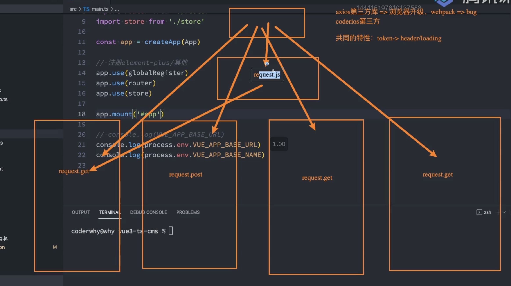

安装 axios：

```shell
npm install axios
```

封装 axios：

```ts
import axios, { AxiosInstance, AxiosRequestConfig, AxiosResponse } from 'axios'
import { Result } from './types'
import { useUserStore } from '/@/store/modules/user'

class HYRequest {
  private instance: AxiosInstance

  private readonly options: AxiosRequestConfig

  constructor(options: AxiosRequestConfig) {
    this.options = options
    this.instance = axios.create(options)

    this.instance.interceptors.request.use(
      (config) => {
        const token = useUserStore().getToken
        if (token) {
          config.headers.Authorization = `Bearer ${token}`
        }
        return config
      },
      (err) => {
        return err
      }
    )

    this.instance.interceptors.response.use(
      (res) => {
        // 拦截响应的数据
        if (res.data.code === 0) {
          return res.data.data
        }
        return res.data
      },
      (err) => {
        return err
      }
    )
  }

  request<T = any>(config: AxiosRequestConfig): Promise<T> {
    return new Promise((resolve, reject) => {
      this.instance
        .request<any, AxiosResponse<Result<T>>>(config)
        .then((res) => {
          resolve(res as unknown as Promise<T>)
        })
        .catch((err) => {
          reject(err)
        })
    })
  }

  get<T = any>(config: AxiosRequestConfig): Promise<T> {
    return this.request({ ...config, method: 'GET' })
  }

  post<T = any>(config: AxiosRequestConfig): Promise<T> {
    return this.request({ ...config, method: 'POST' })
  }

  patch<T = any>(config: AxiosRequestConfig): Promise<T> {
    return this.request({ ...config, method: 'PATCH' })
  }

  delete<T = any>(config: AxiosRequestConfig): Promise<T> {
    return this.request({ ...config, method: 'DELETE' })
  }
}

export default HYRequest
```

